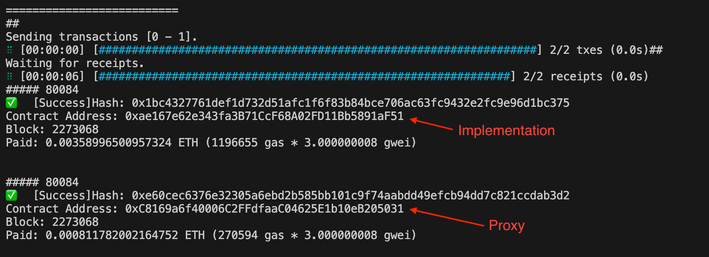

# Upgradeable Contracts on Berachain

This repository contains an example of how to deploy and interact with upgradeable contracts. Specifically, we leverage the [OpenZeppelin Upgrades](https://docs.openzeppelin.com/upgrades-plugins/1.x/foundry-upgrades) plugin to:

1. Deploy an implementation token contract (v1)
2. Deploy a Proxy contract pointing to the v1 contract
3. Deploy an upgrade token contract (v2)
4. Upgrade the Proxy contract to point to the v2 implementation

## Requirements

- Node `v20.11.0` or greater
- pnpm (or another preferred package manager)
- Wallet with Berachain Testnet $BERA tokens - See the [Berachain bArtio Faucet](https://bartio.faucet.berachain.com)
- [Foundry](https://book.getfoundry.sh/getting-started/installation) - ensure `foundryup` is run to install binaries

## Step 1 - Set Up Environment Variables

Copy the `.env.example` file to `.env`

```bash
# FROM: ./openzeppelin-upgrades

cp .env.example .env;
```

Populate the `.env` file with your `PK` and then load the variable into your shell:

```bash
# FROM: ./openzeppelin-upgrades

source .env;
```

## Step 2 - Install Forge Dependencies

Install dependencies by running:

```bash
forge install OpenZeppelin/openzeppelin-contracts openzeppelin-contracts-upgradeable OpenZeppelin/openzeppelin-foundry-upgrades foundry-rs/forge-std --no-commit --no-git;
```

## Step 3 - Run Deployment Script for Deploying Token (v1) and Proxy

Start by compiling the contracts:

```bash
# FROM: ./openzeppelin-upgrades

forge build;
```

Next, run the deployment script `script/DeployProxy.s.sol` (we pin the Solidity version for consistency):

```base
# FROM: ./openzeppelin-upgrades

forge script script/DeployProxy.s.sol --broadcast --rpc-url https://bartio.rpc.berachain.com/ --private-key $PK --use 0.8.25;
```

Take note of your `Proxy` contract address.


## Step 4 - Verify Implementation (v1) Contract

```
# FROM: ./openzeppelin-upgrades

forge verify-contract <IMPLEMENTATION_ADDRESS> ./src/DeFiTokenV1.sol:DeFiToken --verifier-url 'https://api.routescan.io/v2/network/testnet/evm/80084/etherscan' --etherscan-api-key "verifyContract" --num-of-optimizations 200 --compiler-version 0.8.25;
```

Now, when you navigate to your proxy contract on Beratrail, you will see the ERC20 token attributes hooked up to the proxy contract.

## Step 5 - Perform a Proxy Upgrade

Next, we upgrade the implementation contract to v2 (`DeFiTokenV2.sol`).

Clean the build artifacts and then run the upgrade script:

```bash
# FROM: ./openzeppelin-upgrades

forge clean;
forge script script/DeployUpgrade.s.sol --broadcast --rpc-url https://bartio.rpc.berachain.com/ --private-key $PK --use 0.8.25;
```

Now, when checking your proxy contract on Beratrail explorer, you will notice the token name has been updated.


